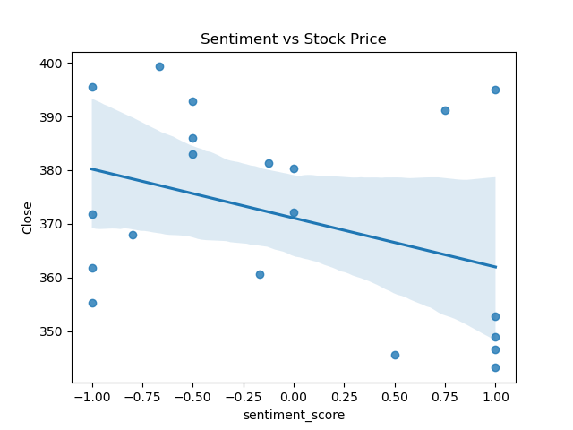

# 📈 News Sentiment & Stock Analysis — Tesla (TSLA)

> An end-to-end NLP and data analysis pipeline that collects real financial news, scores sentiment using VADER, and correlates it with live Tesla stock prices — served through an interactive Streamlit dashboard.


---

## 🧠 Overview

**News Sentiment & Stock Analysis** is a real-world data science project that answers a key question in quantitative finance:

> *Does the sentiment of financial news headlines correlate with stock price movements?*

This project builds a full pipeline — from live news ingestion via **NewsAPI**, through NLP-based sentiment classification with **NLTK VADER**, to time-series correlation with **Tesla (TSLA)** stock prices via **yFinance** — and presents all results in an interactive **Streamlit** dashboard.

The analysis was performed on **78 real Tesla news articles** collected from **14 unique sources** (Business Insider, Gizmodo, The Verge, Autoblog, Wired, and more) spanning **March–April 2026**.

---

## ✨ Key Features

- **Live News Collection** — fetches real-time Tesla news via NewsAPI across 14 media outlets
- **Automated Text Preprocessing** — lowercasing, deduplication, null removal, title + description merging
- **Sentiment Classification** — labels each article as Positive / Negative / Neutral using NLTK VADER compound scores
- **Daily Sentiment Aggregation** — averages sentiment scores per day to align with stock trading dates
- **Stock Price Integration** — fetches TSLA OHLCV data via yFinance and merges on trading date
- **Correlation Visualization** — regression plot of daily sentiment score vs. closing stock price
- **Interactive Dashboard** — Streamlit app with raw data toggle, sentiment distribution bar chart, and correlation plot

---

## 📊 Dataset at a Glance

| Metric | Value |
|---|---|
| Total News Articles | 78 |
| Unique News Sources | 14 |
| Date Range | Mar 12, 2026 — Apr 11, 2026 |
| Positive Articles | 34 (43.6%) |
| Negative Articles | 28 (35.9%) |
| Neutral Articles | 16 (20.5%) |
| Daily Sentiment Records | 29 trading days |
| Stock Ticker Analyzed | TSLA (Tesla, Inc.) |

---

## 🗂️ Project Structure

```
News-Sentiment-Stock-Analysis/
│
├── data/
│   ├── news.csv                # Raw news articles from NewsAPI
│   ├── cleaned_news.csv        # Preprocessed & deduplicated articles
│   ├── final_news.csv          # Articles with VADER sentiment labels
│   └── daily_sentiment.csv     # Daily average sentiment scores
│
├── reports/
│   └── sentiment_vs_stock.png  # Regression plot: sentiment vs. TSLA close price
│
├── get_news.py                 # NewsAPI data collection script
├── clean_data.py               # Text preprocessing pipeline
├── sentiment_analysis.py       # VADER sentiment scoring
├── aggregate_data.py           # Daily sentiment aggregation
├── stock_analysis.py           # yFinance integration & correlation plot
├── app.py                      # Streamlit interactive dashboard
├── requirements.txt
└── README.md
```

---

## 🛠️ Tech Stack

| Category | Tool / Library |
|---|---|
| **Language** | Python 3.8+ |
| **News Data** | NewsAPI (`requests`) |
| **Stock Data** | `yfinance` |
| **NLP / Sentiment** | `NLTK` — VADER SentimentIntensityAnalyzer |
| **Data Processing** | `Pandas`, `NumPy` |
| **Visualization** | `Matplotlib`, `Seaborn` (regplot) |
| **Dashboard** | `Streamlit` |

---

## ⚙️ Pipeline Architecture

```
NewsAPI
   │
   ▼
get_news.py ──► data/news.csv
   │
   ▼
clean_data.py ──► data/cleaned_news.csv
   │  (lowercase · dedup · merge title + description)
   ▼
sentiment_analysis.py ──► data/final_news.csv
   │  (VADER compound score → Positive / Negative / Neutral)
   ▼
aggregate_data.py ──► data/daily_sentiment.csv
   │  (mean sentiment score per trading day)
   ▼
stock_analysis.py + yFinance ──► reports/sentiment_vs_stock.png
   │  (merge on date with TSLA Close price · regression plot)
   ▼
app.py ──► Streamlit Dashboard
```

---

## ▶️ Setup & Usage

### 1. Clone the repository

```bash
git clone https://github.com/venkateshmtn/News-Sentiment-Stock-Analysis.git
cd News-Sentiment-Stock-Analysis
```

### 2. Install dependencies

```bash
pip install -r requirements.txt
```

### 3. Download NLTK VADER lexicon

```python
import nltk
nltk.download('vader_lexicon')
```

### 4. Add your NewsAPI key

Open `get_news.py` and replace the placeholder:

```python
API_KEY = "your_newsapi_key_here"
```

> Get a free key at [newsapi.org](https://newsapi.org)

### 5. Run the pipeline sequentially

```bash
python get_news.py            # Collect news        → data/news.csv
python clean_data.py          # Clean text          → data/cleaned_news.csv
python sentiment_analysis.py  # Score sentiment     → data/final_news.csv
python aggregate_data.py      # Aggregate daily     → data/daily_sentiment.csv
python stock_analysis.py      # Correlate with TSLA → reports/sentiment_vs_stock.png
```

### 6. Launch the interactive dashboard

```bash
streamlit run app.py
```

---

## 📉 Results & Key Finding

The regression plot below shows daily VADER sentiment scores (x-axis) plotted against Tesla's closing stock price (y-axis) over the 29-day analysis period.



**Finding:** The analysis reveals a **weak inverse correlation** between news sentiment and TSLA's closing price during March–April 2026. Days with more positive news sentiment did not consistently correspond to higher stock prices, indicating:

- Short-term TSLA price movements are primarily driven by **broader market forces** (macro conditions, index movements) beyond news sentiment alone
- A 29-day window with 78 articles is a **limited sample** — a larger corpus over a 6–12 month horizon would yield more statistically robust conclusions
- VADER, while effective on general text, may miss **financial nuance** compared to domain-specific models like FinBERT

---

## 🔮 Future Enhancements

- [ ] Swap VADER for **FinBERT** — a transformer model fine-tuned on financial text for higher domain accuracy
- [ ] Expand dataset to 6–12 months for stronger statistical signals
- [ ] Add multi-ticker support (AAPL, NVDA, AMZN) for comparative sentiment analysis
- [ ] Integrate **Twitter/X sentiment** as an additional market signal
- [ ] Deploy Streamlit dashboard to **Streamlit Cloud** for public access
- [ ] Add Pearson/Spearman correlation coefficients and p-values to quantify relationships formally

---

## 📄 License

This project is licensed under the [MIT License](LICENSE).

---

## 👤 Author

**Venkatesh Metan**

[](https://github.com/venkateshmtn)

---

*Built to demonstrate applied NLP, financial data engineering, and end-to-end pipeline development — skills in high demand across data science, fintech, and quantitative analytics roles.*
